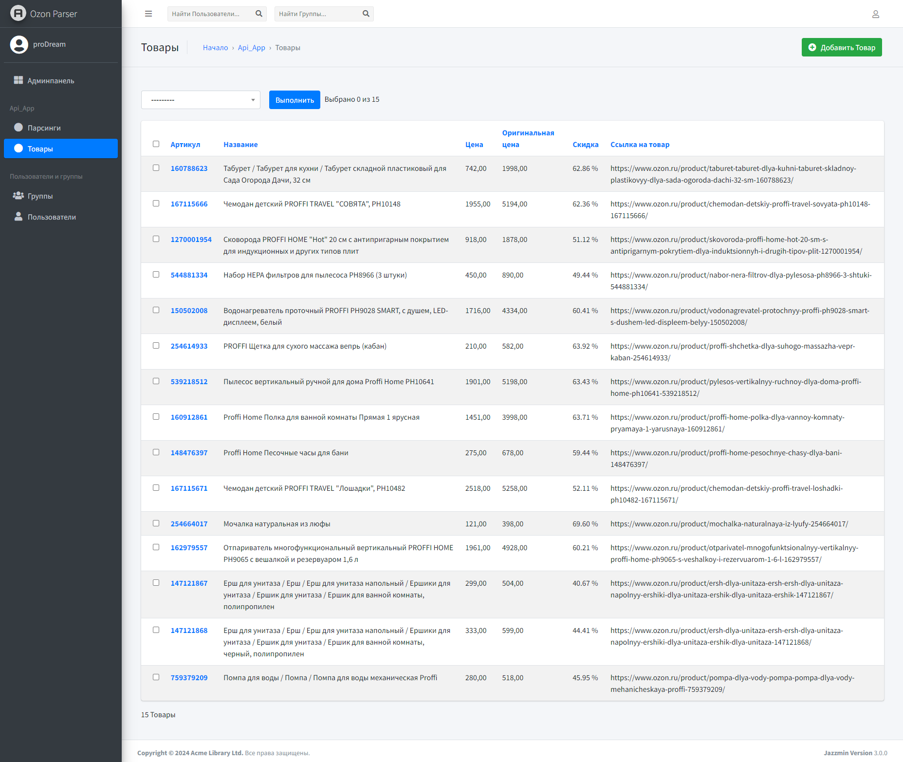

## Тестовое задание для компании POPSO (ИП Варламов Алексей Николаевич).

## Задача:

Реализовать Django-приложение с REST API для парсинга товаров со страницы магазина на ozon.ru и выдачей полученной
информации.  
Также в дополнение необходимо реализовать Telegram-бота для отправки уведомлений об окончании парсинга и
выводе результатов последнего парсинга.

## Используемые технологии:

- `Django` + `Django REST Framework` - основа проекта.
- `drf-spectacular` - для создания API документации.
- `Celery` + `Redis` - для создания очереди задач на парсинг.
- `Beautiful Soup` - для парсинга сайта.
- `Jazzmin` - современный шаблон для панели администратора Django.
- `aiogram` - основа Telegram-бота.
- `requests` - для выполнения HTTP-запросов.

## Запуск:

1. Переименовать файл `.env.example` в `.env` и заполнить соответствующими данными.
2. Выполнить команду `docker compose up -d`
3. Бот запустится и уведомит администратора о запуске. Сайт будет доступен по адресу `http://<ip_сервера>:8000/`.

## Скриншоты:

Панель администратора:  
    
Результаты парсинга:  
  
  
    
Товары:  
    
Запуск парсинга в боте:  
    
Уведомление в боте:  
    
Результат последнего парсинга:  
  
